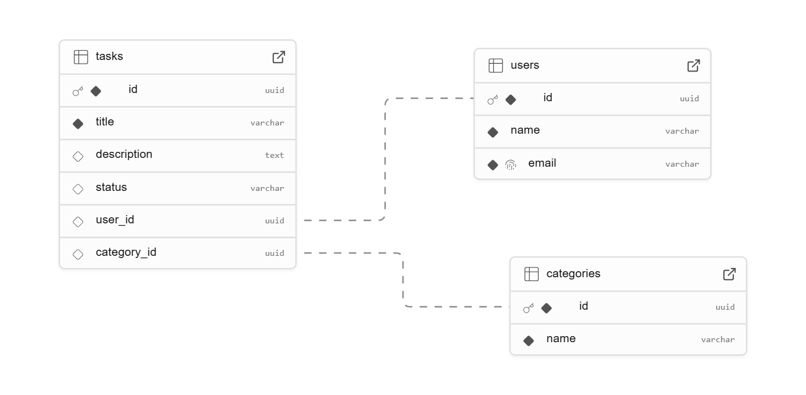

# Web Application Document - Projeto Individual - Módulo 2 - Inteli

**_Os trechos em itálico servem apenas como guia para o preenchimento da seção. Por esse motivo, não devem fazer parte da documentação final._**

## Task's Maker

#### João de Caprio Agmont

## Sumário

1. [Introdução](#c1)  
2. [Visão Geral da Aplicação Web](#c2)  
3. [Projeto Técnico da Aplicação Web](#c3)  
4. [Desenvolvimento da Aplicação Web](#c4)  
5. [Referências](#c5)  

 

## 1. Introdução (Semana 01)

Este projeto consiste na implementação de uma aplicação web do tipo Task Manager, um gerenciador de tarefas estruturado segundo o padrão arquitetural MVC (Model-View-Controller), utilizando Node.js, Express, EJS e PostgreSQL como principais tecnologias. A aplicação tem como propósito permitir o cadastro e gerenciamento de tarefas individuais, categorizadas e associadas a usuários, com persistência de dados em um banco relacional.

A modelagem do sistema foi feita com base em três entidades principais: User, Category e Task. Cada usuário pode autenticar-se e manter um conjunto próprio de categorias e tarefas, permitindo organização personalizada. As tarefas possuem atributos como título, descrição, status (por exemplo: pendente, em andamento, concluída) e associação com uma categoria específica, garantindo uma estrutura lógica para classificação e filtragem.

O backend foi desenvolvido com Express.js, onde as rotas estão desacopladas em arquivos próprios e os controladores são responsáveis por lidar com a lógica de negócio, promovendo uma separação clara de responsabilidades. A camada de persistência de dados utiliza query builders nativos com o módulo pg, com scripts SQL para inicialização e estruturação do banco. A view engine EJS é empregada para renderização dinâmica no frontend, possibilitando feedback visual com base nas operações realizadas pelo usuário.

## 2. Visão Geral da Aplicação Web

### 2.1. Personas (Semana 01 - opcional)

*Posicione aqui sua(s) Persona(s) em forma de texto markdown com imagens, ou como imagem de template preenchido. Atualize esta seção ao longo do módulo se necessário.*

### 2.2. User Stories (Semana 01 - opcional)

*Posicione aqui a lista de User Stories levantadas para o projeto. Siga o template de User Stories e utilize a referência USXX para numeração (US01, US02, US03, ...). Indique todas as User Stories mapeadas, mesmo aquelas que não forem implementadas ao longo do projeto. Não se esqueça de explicar o INVEST de 1 User Storie prioritária.*

---

## 3. Projeto da Aplicação Web

### 3.1. Modelagem do banco de dados  (Semana 3)

### 3.1.1 BD e Models (Semana 5)
Os models adicionados foram apenas 3, dentre eles temos o userModel, taskModel e por fim o CategoryModel.

### 3.2. Arquitetura (Semana 5)

*Posicione aqui o diagrama de arquitetura da sua solução de aplicação web. Atualize sempre que necessário.*

**Instruções para criação do diagrama de arquitetura**  
- **Model**: A camada que lida com a lógica de negócios e interage com o banco de dados.
- **View**: A camada responsável pela interface de usuário.
- **Controller**: A camada que recebe as requisições, processa as ações e atualiza o modelo e a visualização.
  
*Adicione as setas e explicações sobre como os dados fluem entre o Model, Controller e View.*

### 3.3. Wireframes (Semana 03 - opcional)

*Posicione aqui as imagens do wireframe construído para sua solução e, opcionalmente, o link para acesso (mantenha o link sempre público para visualização).*

### 3.4. Guia de estilos (Semana 05 - opcional)

*Descreva aqui orientações gerais para o leitor sobre como utilizar os componentes do guia de estilos de sua solução.*

### 3.5. Protótipo de alta fidelidade (Semana 05 - opcional)

*Posicione aqui algumas imagens demonstrativas de seu protótipo de alta fidelidade e o link para acesso ao protótipo completo (mantenha o link sempre público para visualização).*

### 3.6. WebAPI e endpoints (Semana 05)

*Utilize um link para outra página de documentação contendo a descrição completa de cada endpoint. Ou descreva aqui cada endpoint criado para seu sistema.*  

### 3.7 Interface e Navegação (Semana 07)

Na última versão do meu projeto quando você entrava nas rotas aparecia apenas um json, então nesta versão eu trabalhei no front end do trabalho. Dentro dele produzi 3 páginas no meu projeto, página inicial, página de usuários e por fim página de categorias. Tive que implementar um código html e modificar o css para fazer o design do front-end, além de ajustar as rotas para não ter nenhum problema. A tela de login você entra nela preenche um fórmulario com seus dados, depois é redirecionado para a tela de usários onde aparece uma tabela com o usuário que você criou, e uns outros exemplos para preencher a tabela, após isto você retorna a pagina inical e entra no botão "categorias" que te direciona para a página das categorias onde você vê uma lista de categorias para sua tarefa e depois pode até preencher o forms com o nome da sua tarefa e em qual categoria ela se encaixa. Além disso tem a tabela das suas tarefas onde você pode criar uma tarefa e armazenala pra ver mais tarde.
 # Página inicial 
# Página de usuários 
# Página de Tarefas  
# Página de categorias  
## 4. Desenvolvimento da Aplicação Web (Semana 8)

### 4.1 Demonstração do Sistema Web (Semana 8)

*VIDEO: Insira o link do vídeo demonstrativo nesta seção*
*Descreva e ilustre aqui o desenvolvimento do sistema web completo, explicando brevemente o que foi entregue em termos de código e sistema. Utilize prints de tela para ilustrar.*

### 4.2 Conclusões e Trabalhos Futuros (Semana 8)

*Indique pontos fortes e pontos a melhorar de maneira geral.*
*Relacione também quaisquer outras ideias que você tenha para melhorias futuras.*

## 5. Referências

_Incluir as principais referências de seu projeto, para que o leitor possa consultar caso ele se interessar em aprofundar._ 

---
---
